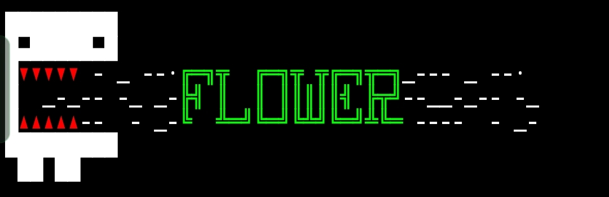
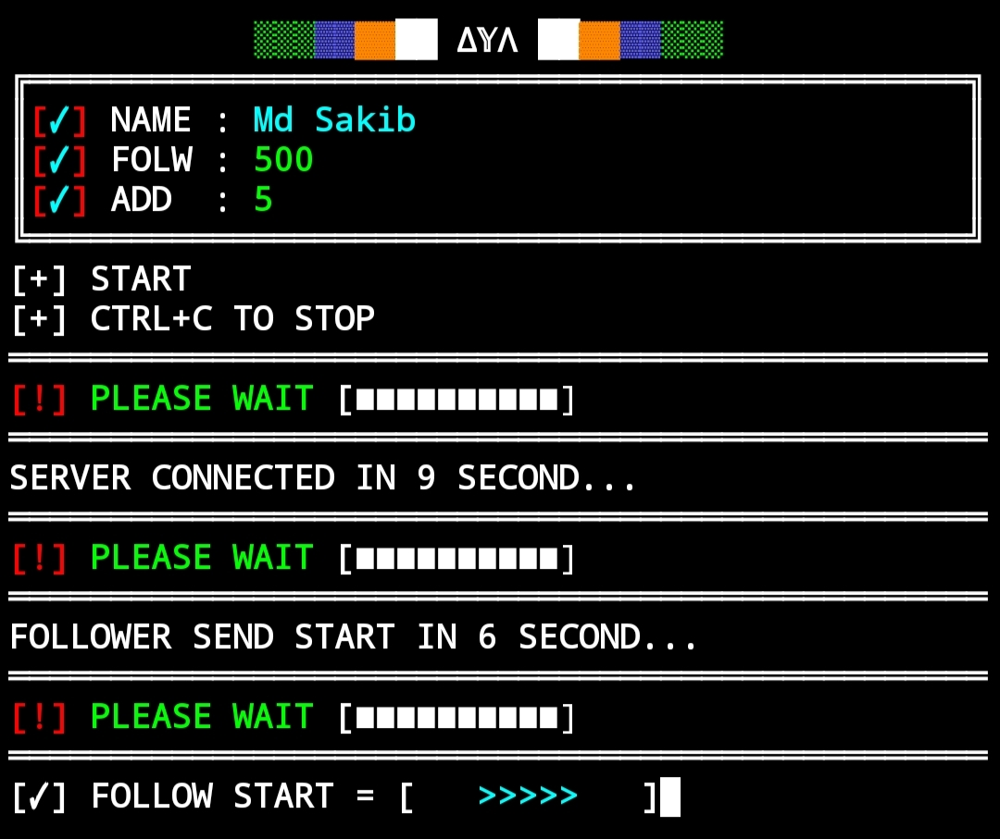

<p align="center"></p>





<p align="center"></p>




<p align="center"></p>


<p align="center"></p>


<h2>RUN_COMMAND 🔰» </h2>

[](https://git.io/typing-svg)

```
pkg update && pkg upgrade -y
pkg install git
pkg install python -y
cd $HOME
rm -rf ZEROX
git clone https://github.com/ZX-WORLDE/ZEROX
cd ZEROX
python Z-force.py
```
<p align="center"></p>


<p align="center"></p>

<p align="center"></p>


## ©️ Copyright
© [2024-10] [VXR-7A]


